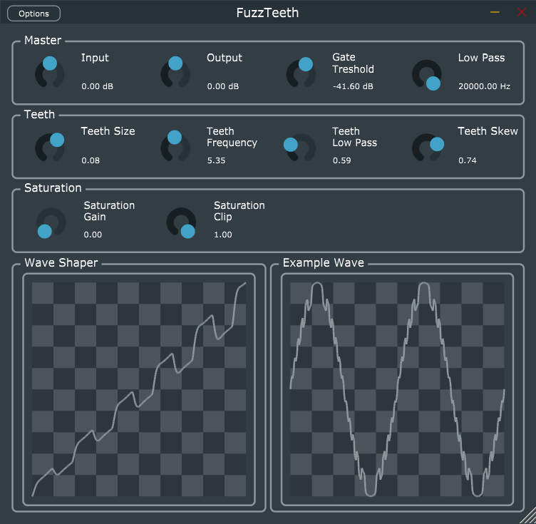

# FuzzTeeth
Distortion VST3 plugin made with JUCE.

What makes this plugin quite unique, is the way that it distorts audio.
Instead of relying on making shape of the wave more square-like, it also makes it look like it would have "teeth" (hence the name).
This aproach gives a lot of new harmonics to the signal, making it "robot - like".

This plugin sounds great applied on guitar.

## Controls

* Master
	* Input - Simple gain before the distortion.
	* Output - Simple gain after the distortion.
	* Gate Treshold - Treshold, in dB, for built-in noise gate.
	* Low Pass - Frequency, in Hz, for built-in low pass filter.
* Teeth
	* Teeth Size - The bigger value, the more distored signal and bigger teeth.
	* Teeth Frequency - how many teeth there will be?
	* Teeth Low Pass - frequency for low pass applied only to teeth.  "0" means filtering all the frequencies, while "1" leaves all of them.
	* Teeth Skew - values bigger than 0 means that theeth are bigger for bigger sample values. The bigger this value is the bigger the difference between size of teeth at the beginning and at the end of waveshaper function.
* Saturation
	* Saturation Gain - classic saturation, made with waveshaper function atan(x).
	* Saturation Clip - treshold for hardclipping. 0 means completely square wave.